# Making a custom MIDI controller

A while ago I bought myself a Deepmind 12D synth, which is a desktop synth you can fit with rack mounting ears to sit comfortably inside a 19" mounting rack.

Whilst looking for a flight case to make a rails in myself I quickly found out that there are flight cases for this specific use case called "mixer cases".

This made me think: what if I buy a mixer case with some spare room so I can mount something else in the case too?

Because I like to read about build projects other people did, if only just for inspiration I decided to share my process.

## My setup before the build

To feed my Deepmind MIDI input I can either choose to use a 5 pin MIDI cable, or the USB port for both MIDI in and out. Because the latter is easier and one less cable I decided to go with that.

Because I like USB powered simple MIDI controllers I needed some way to get a MIDI signal from my devices into the Deepmind. Normally you'd just plug in your USB plug into your computer's USB port to send MIDI notes to it, this however doesn't work for the Deepmind. We'd need a MIDI host to handle the communication for us.

Luckily there is a way to turn a Raspberry Pi into a MIDI quite easily. I found [these instructions to turn a Raspberry Pi into a MIDI host](https://neuma.studio/rpi-as-midi-host.html). And there so happens to be a Raspberry Pi collecting dust inside one of my cabinet drawers. Problem solved!

To sum up I had MIDI controllers connected through USB to the Raspberry Pi MIDI host and a USB cable from my Deepmind to the host. One extra cool thing is is that you can also send MIDI signals to the host through Bluetooth. This way I can still communicate with the Deepmind from my favourite DAW too.

## How I got the idea

When the mixer case arrived I fitted in the Deepmind and I quickly learned that there was actually plenty room left to add stuff under the synth and also have some room left below for other devices.

I looked around on the internet for 19" mountable MIDI controllers, but didn't find what I was looking for. I essentially just use a small key bed and a pitch bend and mod wheel for playing live. The music isn't that keyboard heavy, but it's nice to have at least these inputs.

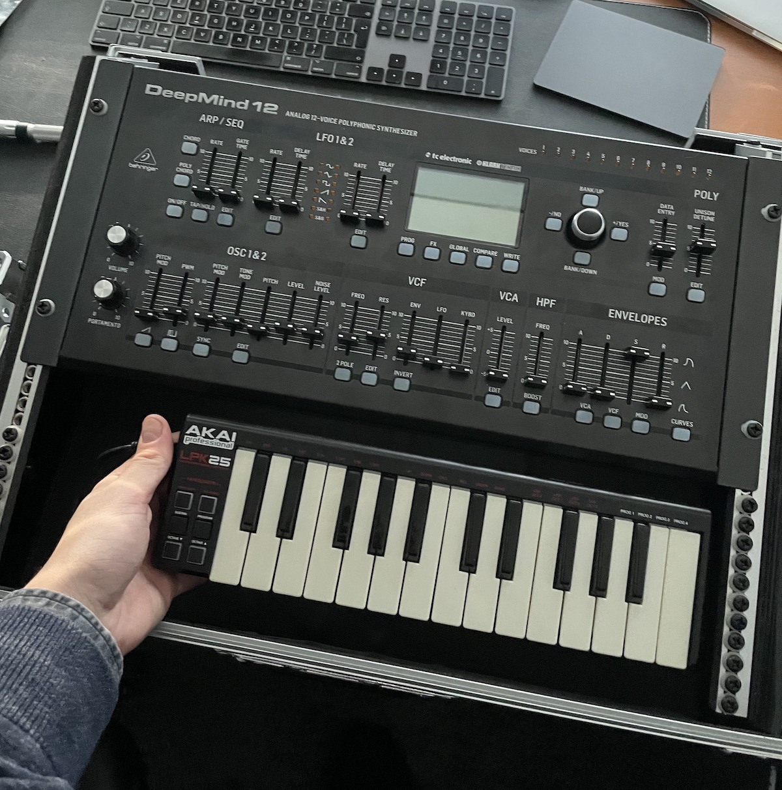 

Then I was reminded about one of my old favourite desktop mini MIDI controllers which would actually fit perfectly inside the room which was left available. I screwed it open to see how hard it would be to use its insides.

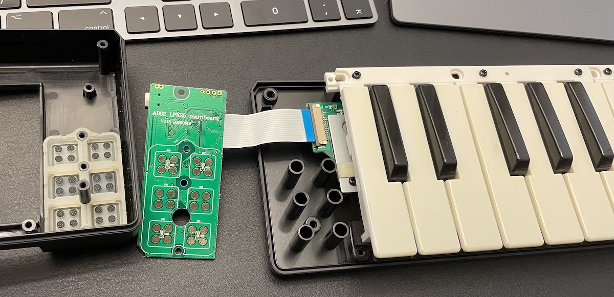

Looks easy enough! I had some spare time that weekend and nothing better to do, and so I thought:  Let's give this a try! 

## Planning it out

Because the Akai LPK25 sadly has no pitch bend and mod wheel I need to see if I could somehow fit those next to the key bed and buttons on a plate mounted in the rack.

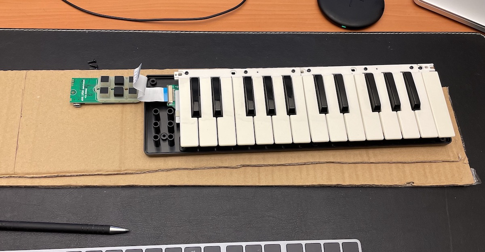

On a piece of cardboard I roughly sketched out how the layout of the synth was going to look like.

I remembered I got an old gaming controller which I could use the joystick of for the pitch bend. So I went tested if I could write a bit of code to change the pitch sending out MIDI signals with the USB controller's joystick. And that worked, but I knew that I also needed a mod wheel which didn't flick back into position when changing.

## Getting nerdy

I am by no means any good at soldering or electrical engineering, but I am confident enough to at least give it a try. Thought this might be a perfect excuse to try and make my own small MIDI controller device which does pitch and mod. 

I looked at some websites for Arduino MIDI setups and potentiometers, there are a lot of people who have already done this and that give me inspiration.

As I was talking about my idea a friend offered me a big case of Arduino related stuff, so I could have a go at creating my idea.

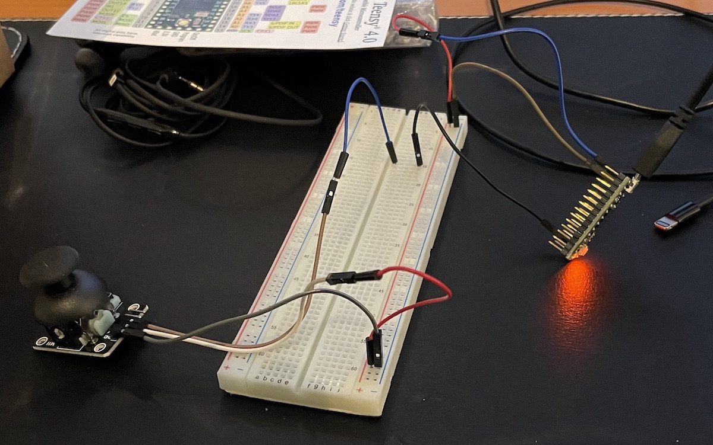

It so happens that this kit also included a joystick which was really easy to connect to an Arduino.

After spending the night learning about the breadboard, Arduino, and reading values, and making LEDs blink I found out Arduino on its own can't send MIDI signals, but a Teensy board was able to.

I decided to leave the project for now and order all the stuff I'd need for assembling my MIDI controller.

My plan was to have a Teensy board which would connect to my MIDI host and act as my extra MIDI controller. Yes, combined with the Akai LPK25 that's two MIDI controllers.

## Arduino part 2

When my parts finally came in it was time to assemble the setup in the breadboard again for debugging.

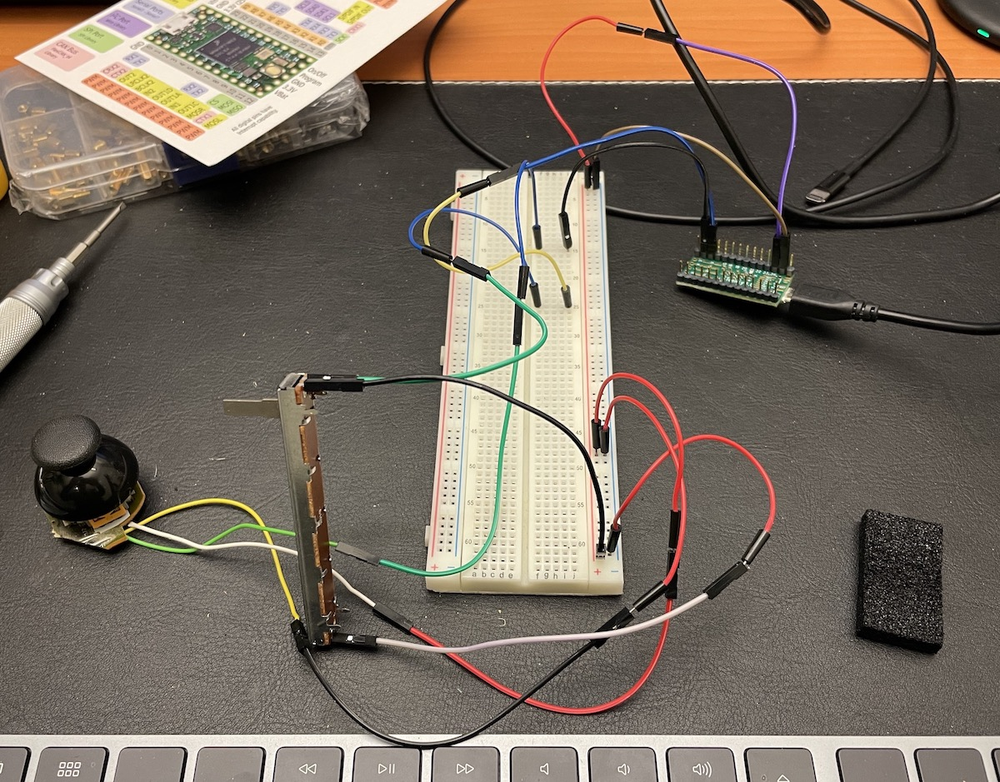

As you can see I added a sliding potentiometer as my input for mod. Also notice that the joystick looks a bit different.

This joystick is the one that was on the game controller. I found out that the joysticks I used before have a very shitty range and reached their maximum value after only wiggling the joystick for just 20% or so.

I looked at the insides of the USB game controller and saw solder points below the stick which looked a like those on the other one. I tried soldering these points and connected them to the Teensy. Not only did it work, the range was also a lot better. I also tried to solder the other joystick directly under the potentiometer, but that had the same bad results.

With a saw bit I was able to cut of the joystick from the rest of the controller.

After [a bit of coding](./arduino/AnalogControlChange.ino) the Teensy was ready to go.

## Wood working... or at least trying to

Next came the part I was most nervous for: creating the plate and making the holes for all parts to fit in.

The first step of cutting the piece of wood to my desired dimensions was easy enough.

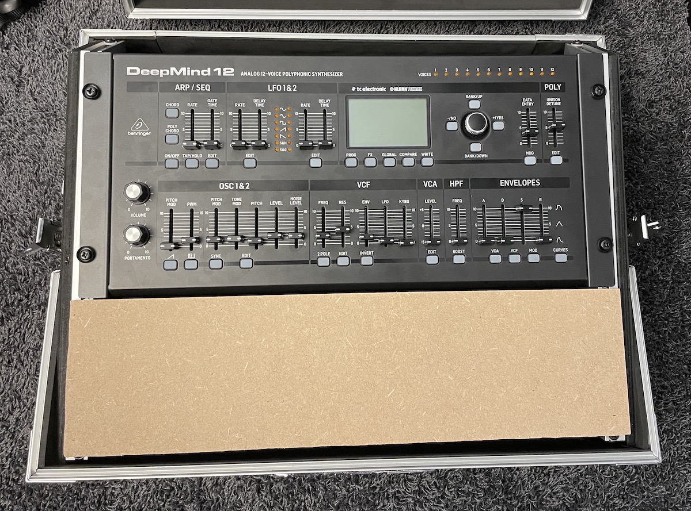

I then drew all the different parts on the plank and went to work with a Dremel and saws. This was the result.

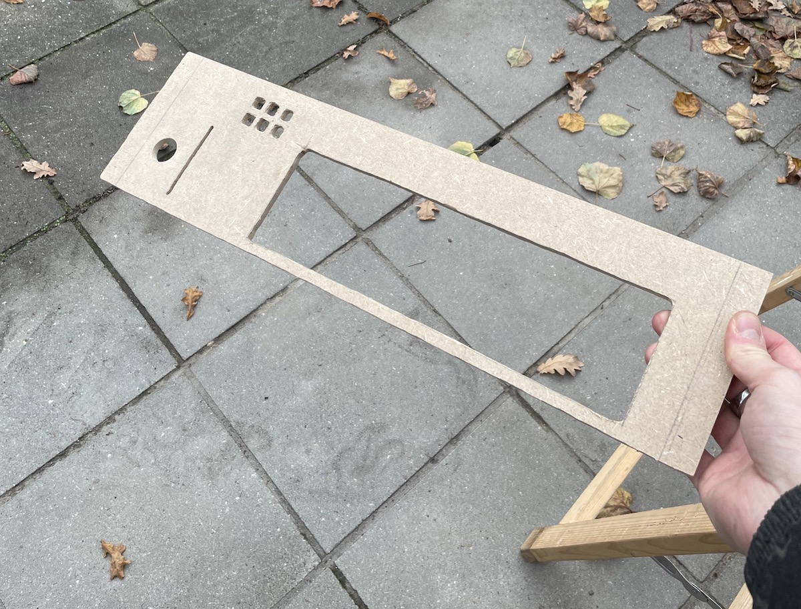

After I tried to fit all the parts of the controller in there I realised I made a mistake and had to redo the whole plate. So I did that the next day and this time everything was alright.

## Assembling

First I fitted the buttons and pcb of the Akai LPK25 to the board.

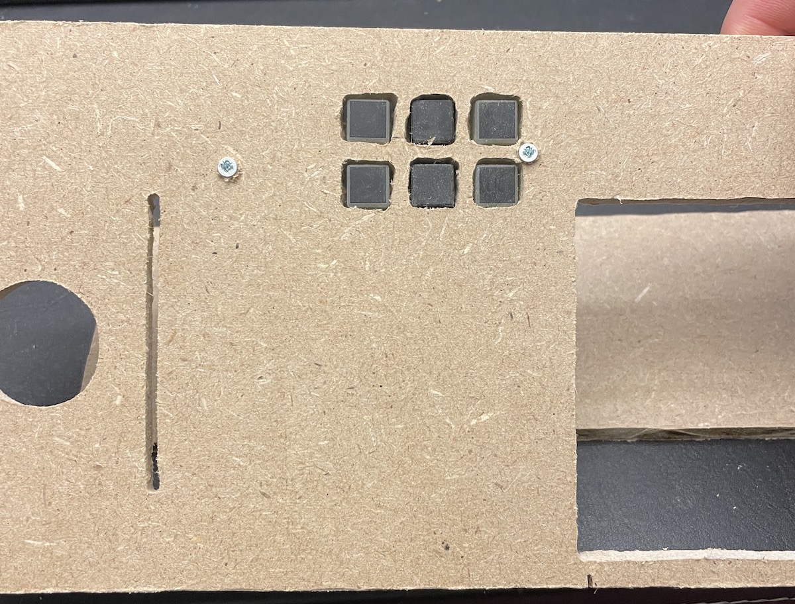

Secured to the board with some screws and washers for spacing and keeping it in place.

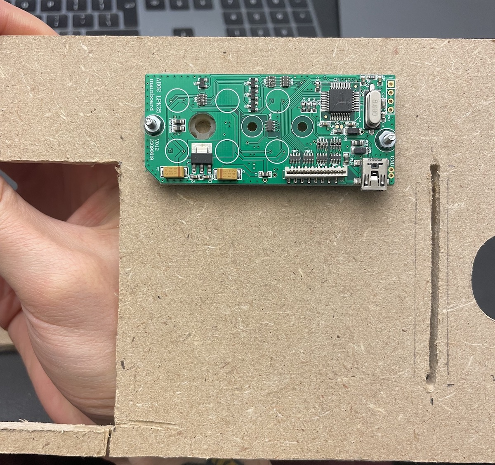

Next was securing the key bed which was actually pretty okay. It was originally attached to the top piece of plastic and was able to use screws and fix the key bed on the board directly.

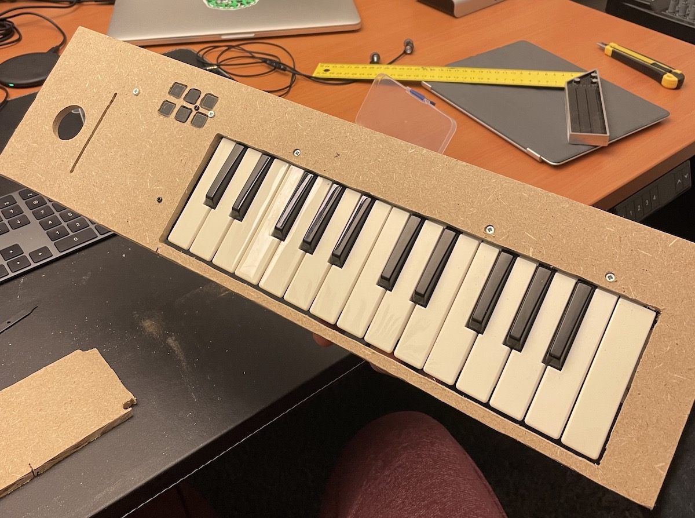

After that I wanted to fit the sliding potentiometer and the joystick, so they were usable on the other side of the board.

The slider was easy enough. After finding out how it would align perfectly I went and glued it directly on the board. Maybe not the best solution, but it works!

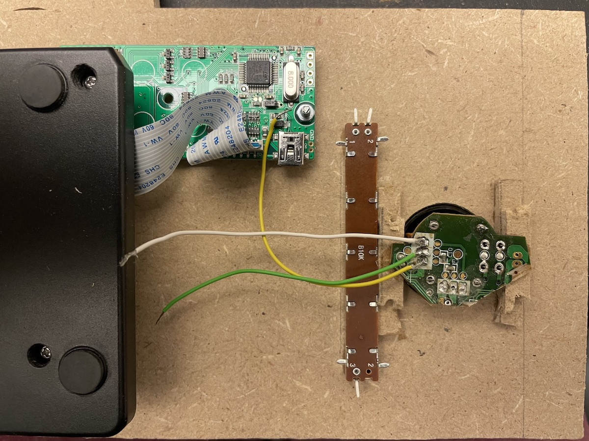

The joystick needed some small pieces of wood as spacing, which I also glued directly on the board. I also decided to add a little metal plate behind the joystick and screw it to the plate as stability.

## Finishing and wiring it up

The last step was wiring the two beasts up fitting it in the rack.

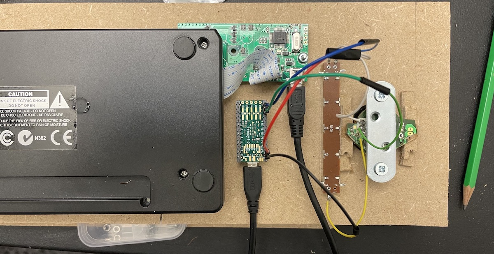

Some soldering and connecting later this was the result. Not really that complicated, but happy with the result.

I glued the Teensy's usb cable to the board and not the Teensy itself, this makes it possible to still remove it, and it actually sits there pretty firm in place.

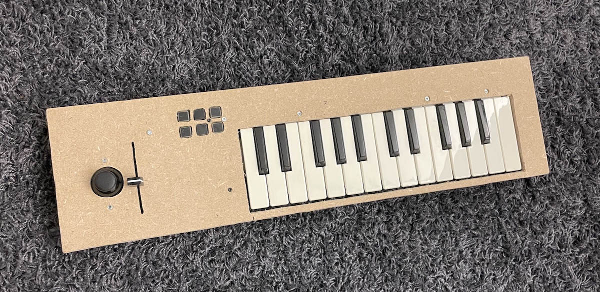

All that was left was to secure the board in my mixer case and try it out.

After some changes and tweaks in the code it works perfectly, and I am really with how it came out.

I'll probably get a professionally done laser cut version of the board, but it was fun to experience wood working for once.

You can find all the code and other stuff in this repository.

Cheers! Gaya